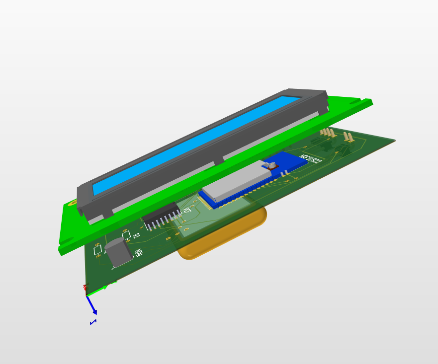
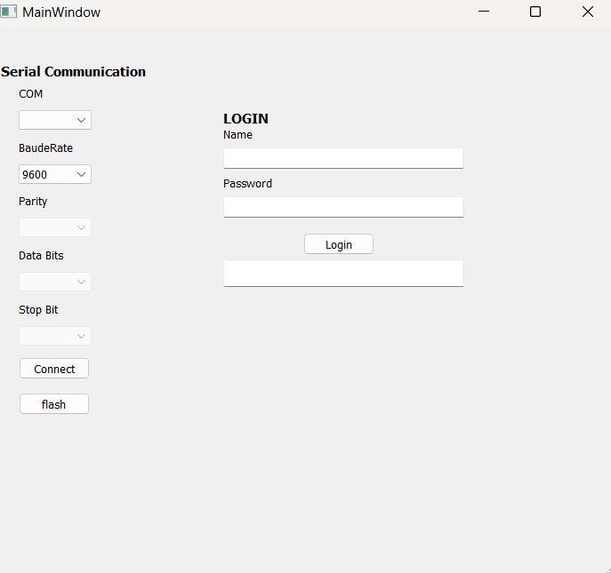
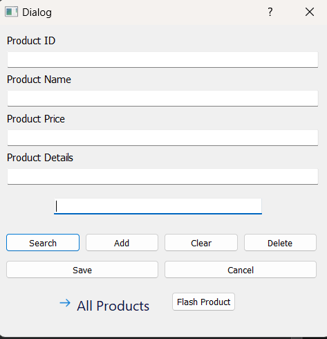
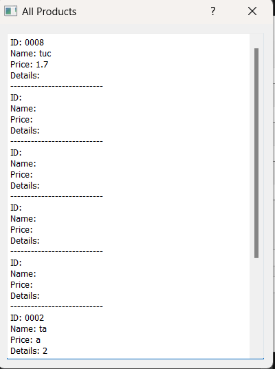

# Electronic Data Distribution System on Label Tags

This project presents a complete embedded and GUI-based solution for distributing electronic data across smart label tags. It leverages wireless BLE communication and I²C/UART protocols, offering a dynamic and modular architecture suitable for scalable deployment in inventory, retail, or industry environments.

---

## 📌 Project Overview

The system is built around the **nRF51822 SoC** and consists of **master-slave architecture**. Each slave card is equipped with an LCD to display received data. Communication is ensured by:

- **BLE** (Bluetooth Low Energy): used for data broadcasting between central and peripheral nodes.
- **I²C**: used for inter-module communication between MCU and peripherals like LCD.
- **UART**: used for serial debugging and optional communication with a PC or controller.
- **SPI Flash Memory**: allows data storage and retrieval on both master and slave nodes.

A **Qt-based GUI** acts as the human-machine interface (HMI), where users can input and manage label data, which is then pushed wirelessly to the electronic tags.

---

## 🔧 Technologies Used

- **nRF51822** firmware (written in C): BLE stack, I²C master/slave, UART.
- **Qt (C++)**: GUI interface for desktop applications.
- **SQLite**: Lightweight database to manage label content.
- **Altium Designer**: PCB design and 3D modeling of the master and slave cards.

---

## 🖼️ Project Images

### 🔌 Hardware Design

Master and Slave PCB Boards:

### 🧑‍💻 GUI Interface Screenshots

Interface built with Qt for label management:

